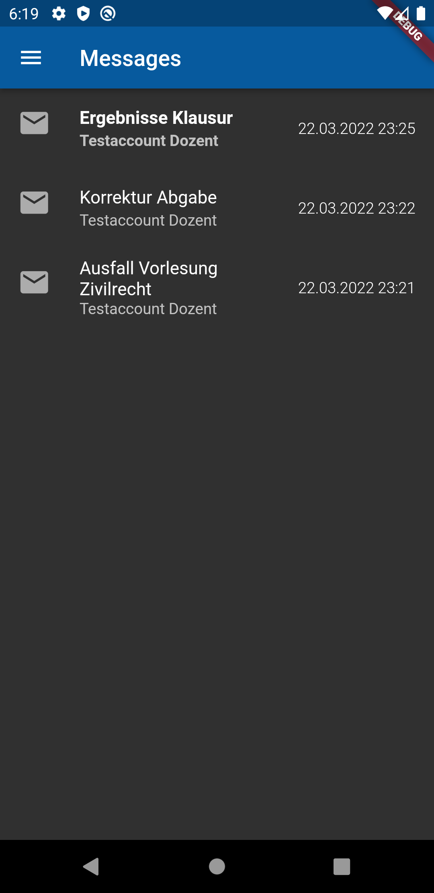
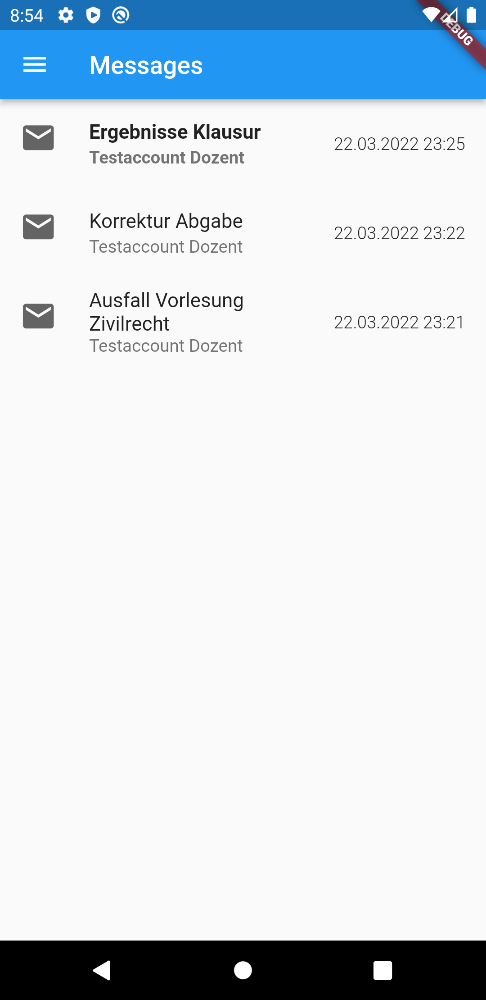
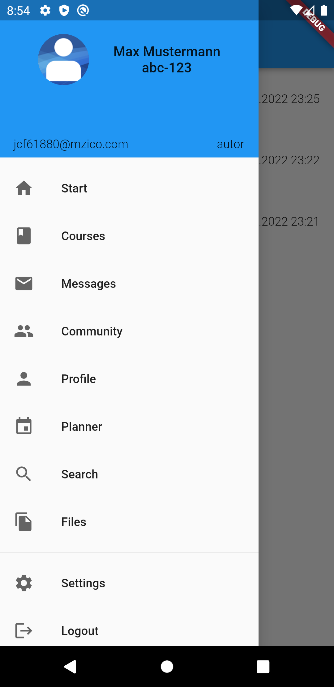
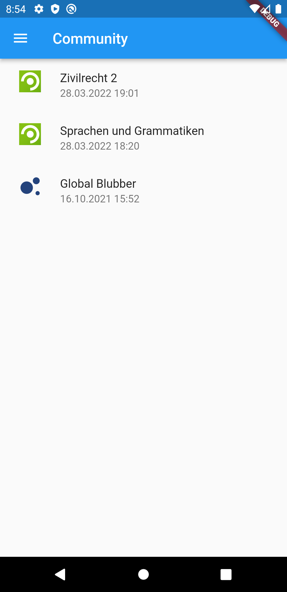
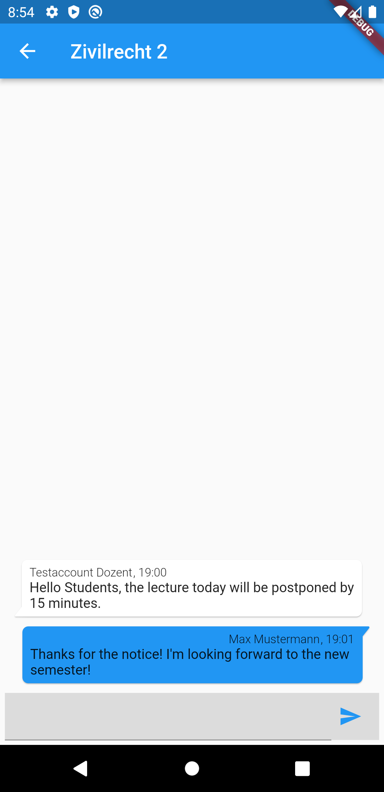

# Table of contents
1. [Features](#features)
2. [How to enable](#how-to-enable)
3. [Gallery](#gallery)

## Features
* &#33; Global announcements
* &#128214; Courses
    * &#128172; Forum
    * &#129302; Members
    * &#128463; Wiki
    * &#128193; Files
    * &#128269; Search
    * &#9094; Sign Up/Leave
* &#128231; Messages
* &#128490; Blubber
* &#128466; Planner
* &#128262;/&#127761; Light/Dark theme

## How to enable
#### Register
1. Login as Administrator
2. Navigate to Admin -> System -> API
3. Register new application / Fill in the required information
4. Give the consumer secret, consumer key and your StudIP URL to me in a secure manner (e.g. encrypted email)

#### Enable required routes
1. Login as Administrator
2. Navigate to Admin -> System -> API -> Global access settings
3. Enable the following routes:
    * /blubber/threads (GET)
    * /blubber/threads/:thread_id (GET)
    * /blubber/threads/:thread_id/comments (POST)
    * /course/:course_id/forum_categories (GET)
    * /course/:course_id/members (GET)
    * /course/:course_id/news (GET)
    * /course/:course_id/top_folder (GET)
    * /course/:course_id/wiki (GET)
    * /course/:course_id/wiki/:keyword (GET)
    * /discovery (GET)
    * /file/:file_ref_id (GET)
    * /folder/:folder_id (GET)
    * /forum_category/:category_id/areas (GET)
    * /forum_entry/:entry_id (GET)
    * /message/:message_id (DELETE, PUT)
    * /semesters (GET)
    * /studip/news (GET)
    * /user (GET)
    * /user/:user_id (GET)
    * /user/:user_id/:box (GET)
    * /user/:user_id/courses (GET)
    * /user/:user_id/schedule (GET)

## Gallery
#### Dark

    
    
    
    
    
    

#### Light

    
    
    
    
    
    

